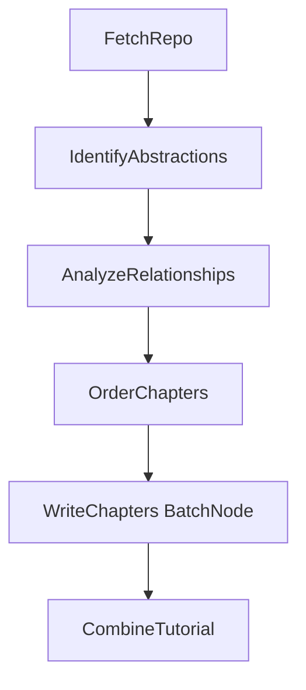

# Codebase Tutorial Flow (PocketFlow)

This skill captures the **flow and concept** of the Codebase Knowledge Builder: turn a GitHub repo or local directory into a beginner-friendly, AI-generated tutorial. The pipeline is a **sequential workflow** (Graph + Shared Store); each step can be implemented by the script (nodes + LLM) or by an agent following this skill.

## Flow Overview

| Order | Node | Type | Purpose |
|-------|------|------|---------|
| 1 | **FetchRepo** | Node | Crawl GitHub or local dir; populate `shared["files"]` as list of `(path, content)` tuples. |
| 2 | **IdentifyAbstractions** | Node | Identifies 5–10 core abstractions: `name`, `description`, `files` (file indices). Writes `shared["abstractions"]`. |
| 3 | **AnalyzeRelationships** | Node | Produces project `summary` and `relationships` (from/to indices + label). Writes `shared["relationships"]`. |
| 4 | **OrderChapters** | Node | Orders abstraction indices for tutorial. Writes `shared["chapter_order"]`. |
| 5 | **WriteChapters** | BatchNode | For each abstraction (in `chapter_order`), writes one chapter; uses prior chapters as context. Writes `shared["chapters"]`. |
| 6 | **CombineTutorial** | Node | Builds Mermaid diagram, `index.md`, and chapter `.md` files; writes `shared["final_output_dir"]`. |

Entry point: build `shared`, create the flow, run `flow.run(shared)`.

## Skill folder (standalone)

This skill **operates independently**: all scripts needed to run the pipeline live in this skill directory.

- **`main.py`** — CLI: `python main.py --repo <url>` or `python main.py --dir <path>` (options: `--name`, `--output`, `--include`/`--exclude`, `--max-size`, `--language`, `--no-cache`, `--max-abstractions`).
- **`flow.py`** — `create_tutorial_flow()`, wires nodes.
- **`nodes.py`** — FetchRepo, IdentifyAbstractions, AnalyzeRelationships, OrderChapters, WriteChapters, CombineTutorial.
- **`utils/`** — `crawl_github_files.py`, `crawl_local_files.py`, `call_llm.py`.
- **`requirements.txt`** — pocketflow, pyyaml, requests, gitpython, google-genai, python-dotenv, pathspec.

**Run from this skill’s directory:** `pip install -r requirements.txt`, set `GEMINI_API_KEY` (or `LLM_PROVIDER` + provider env vars), optionally `GITHUB_TOKEN`, then `python main.py --repo <url>` or `python main.py --dir <path>`. Output → `output/<project_name>/`.

**As an agent (playbook):** Follow this skill: maintain shared store (dict), do each step in order — FetchRepo → IdentifyAbstractions (YAML) → AnalyzeRelationships (YAML) → OrderChapters (YAML) → WriteChapters (one Markdown chapter per abstraction) → CombineTutorial (write index.md and chapter files). The agent uses its own tools and model; this skill defines the flow and data contract.

## Shared Store Contract

**Inputs** (set by the app entry point or caller):

- `repo_url` or `local_dir` (one required), `project_name` (optional, derived if missing)
- `github_token`, `output_dir`, `include_patterns`, `exclude_patterns`, `max_file_size`
- `language`, `use_cache`, `max_abstraction_num`

**Produced by pipeline** (do not assume present before a node runs):

- `files`: list of `(path, content)` tuples (FetchRepo)
- `abstractions`: list of `{"name", "description", "files": [int]}` (IdentifyAbstractions)
- `relationships`: `{"summary": str, "details": [{"from", "to", "label"}]}` (AnalyzeRelationships)
- `chapter_order`: list of abstraction indices (OrderChapters)
- `chapters`: list of Markdown strings (WriteChapters)
- `final_output_dir`: path string (CombineTutorial)

All indices (file indices, abstraction indices) are **zero-based**. Abstractions reference files by index into `shared["files"]`; relationships use abstraction indices.

## Key Conventions

- **Indices over names:** Abstractions store `files` as list of integers (indices into `files`). Relationships use `from`/`to` as abstraction indices. This avoids duplication and keeps the store minimal.
- **Language:** `shared["language"]` drives translation of names, descriptions, summary, labels, and full chapter text. Fixed UI strings (e.g. "Chapters", "Source Repository") stay in English.
- **Caching:** `call_llm(..., use_cache=...)` with `use_cache=(shared["use_cache"] and self.cur_retry == 0)` so retries bypass cache.
- **Validation:** LLM outputs are parsed from YAML in fenced blocks; nodes validate structure and indices and raise on failure (Node retries apply).

## Where to Change What

Use this skill as the source of truth; no external project docs are required.

| Goal | Where (in the codebase) |
|------|-------------------------|
| Change flow order or add/remove nodes | This skill (flow + steps), then this folder’s `flow.py` and `nodes.py`. |
| Change shared store shape | This skill (Shared Store), then this folder’s `main.py` and nodes. |
| Adjust LLM prompts or parsing | This folder’s `nodes.py`, each node’s `exec()`. |
| Add/modify crawl or LLM behavior | This folder’s `utils/` (call_llm, crawl_github_files, crawl_local_files). |
